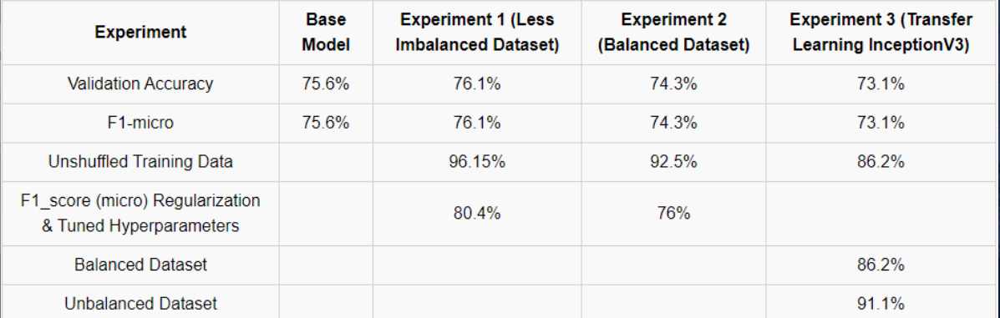
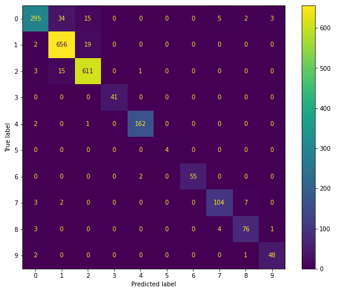

# Experimenting with Data Augmentation: Galaxy10 Dataset
(note: I am having trouble uploading my heavy saved models and data I did from this project)
## Problem Statement
The Space Photography Guild Association hired me as a data scientist consultant to create a model that predicts and classifies galaxy images that are captured by various amatuer astrophotographers around the world. 

The goal is to reduce the amount of time it would take to classify galaxy images which is done right now by hand through the help of many volunteers voting on what type of galaxy the image is.

## Methodology
1. Load in the galaxy10 data from the astroNN dataset through import
2. Perform EDA
3. Build a naive Convolution Neural Network (CNN) to set up as our base model
4. Grid Search to tune hyperparameters of the naive model
5. Try Different methods (3 experiments) to beat the F1-micro score of the naive model
    - EXPERIMENT 1: Data Augment the lower represented class to create data 
    - EXPERIMENT 2: Bring all the classes in the dataset to match in size. 
    - EXPERIMENT 3: Use transfer learning to train on the original dataset or augmented dataset  
6. Evaluate models based off of their F1-micro score
## Data Information
- Total Images: 21785
- Number of classes: 10
- Model Type: Multi Classification
- Data Source:
    https://astronn.readthedocs.io/en/latest/galaxy10.html

### Data Dictionary

| Feature |  Type | Dataset                       | Description                                                              |
|:-------:|:-----:|-------------------------------|--------------------------------------------------------------------------|
| images  | uint8 | astronn.dataset.load_galaxy10 | 69x69 RGB images stored in a NumPy array                                 |
| labels  | int   | astronn.dataset.load_galaxy10 | Labels representing the 10 (class 0 through 9) different types of images |

## EDA
Here are the 10 different galaxy images from Class 0 through Class 9:

Here is what represents the overall dataset:

The dataset is very unbalanced. 3 classes account for most of the dataset
Class 1  32%, Class 2  28%, and Class 0  16%. All other classes each represented 7% or less of the dataset.

This is what the train dataset looked like after doing a train_test_split:

Here are some examples of data augmentation on an image:

For **Experiment 1** I did random variations of augmentation to create synthetic data for the lower represented classes.  My goal was to have a total of 4000 images for each of the classes that are not Class 1 or Class 2 and create a model with that dataset:

For **Experiment 2** I used the same dataset above but I cut out some of the data in Class 1 and Class 2 to have a total of 4000 images for both of them to match the other classes to give us a balanced dataset:

=============================================================
## Summary of Analysis

### Experiment 1: 
I Trained my dataset on a less imbalanced dataset while keep the two highest classes of images data size the same. 

### Experiment 2: 
I took the dataset from the previous experiment but cut down the two highest classes to match the data size of the other classes and then trained on it.

### Experiment 3: 
Take the training datasets from the two previous experiments and apply transfer learning to them.

----------------------------------------------------------------

#### Final Results:

**All the scores that are shown here are F1-micro score besides the first row score!**

All my models do great against our baseline score (the percent of the highest represented class) which was 32%! 
The score I am maximing for is F1-micro score because micro-averaging will put more emphasis on the common labels in the data set since it gives each sample the same importance.
Labels that are very rare in the dataset, e.g., a genre that only represents 0.01% of the data examples, may not be intended to influence the overall F1-score heavily if the model is performing well on the other more common genres.

Experiment 1 results did better then Experiment 2 results because of the loss of data for Experiment 2. That loss of data was extra weights the neural network was learning from to better classify against unseen data.
The best experiment was the transfer learning experiment. Though it did the worst initially with the original pre-augmented training data, it got the best score after training it with the unbalanced dataset from Experiment 1. The transfer learning model I used was Inceptionv3 which had around 300+ layers in its neural network compared to my base model which has 10 layers. From Inceptionv3 I froze the first 172 layers so that it wont be retrained on so that I do not destroy any weights or information that it already contains.  All the layers after layer 172, I train them against my augmented dataset which causes the score to jump from 73% to near ~90%.

Here is how the accuracy of the model in Experiment 3 was getting better over each epoch:

Also the loss reduced significantly over time:

And finally the confusion matrix of this model:

Experiment 3 had the best outcomes.  It had a 94% Validation Accuracy, 27% Validation loss and 94% Micro-F1 score!

## Conclusion and Recommendations:
In conclusion if we were to go with a model right now to classify galaxy images, we would go with Experiment 3 model! We see that even though we created a balanced dataset through experiment 2, it doesn't give us a better score then our imbalance dataset in experiment 1.  This shows that the more data is available for a machine learning model, the better it will do. More data makes a more rigid model! A plus note also is these experiments did better the smaller the batch size.  The smaller the batch size causes the model to generalize better to unseen data!

## What's Next? - Future Study/Research
- Do more experiments with various data sizes and techniques
- See if certain image augmentation method is better over another
- Collect more real world data for the least represented classes
- Get funding to work on a cloud environment (AWS, Google Cloud)
- Further hypertune/experiment with other/more hyperparameters
- Experiment with higher quality images like 4k resolution images

## Sources
- https://astronn.readthedocs.io/en/latest/galaxy10.html (Galaxy10 Dataset)
- Top Data Augmentation Techniques: Ultimate Guide for 2022 (aimultiple.com)
- Data Augmentation | How to use Deep Learning when you have Limited Data (nanonets.com)
- https://keras.io/guides/transfer_learning/
- https://towardsdatascience.com/a-comprehensive-hands-on-guide-to-transfer-learning-with-real-world-applications-in-deep-learning-212bf3b2f27a
